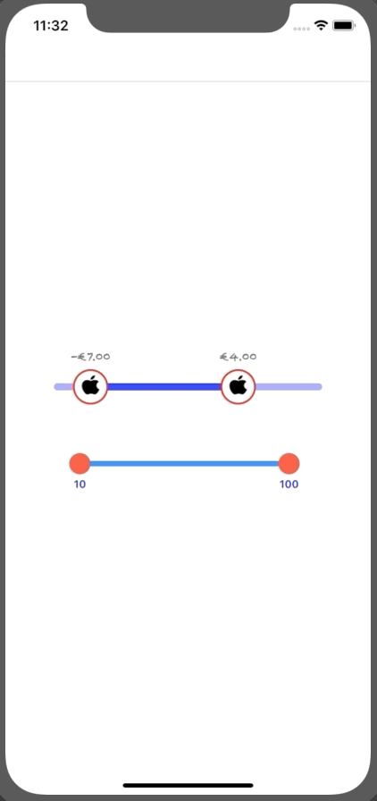

# GNRangeSlider

 <a href="https://developer.apple.com/swift"></a> <a href="https://github.com/nicolaouG/GNRangeSlider/blob/master/LICENSE"></a>

A fully customisable range slider




## Getting started
```
platform :ios, '10.0'

pod 'GNRangeSlider'
```

## How to use

Customise it how you like it
```swift
let s = GNRangeSlider(textPosition: .top, tracking: .animatable)
s.minimumValue = -10
s.maximumValue = 10
s.lowerValue = -7
s.upperValue = 4
s.step = 0.5
s.minimumSelectedRange = 1
s.trackColor = UIColor.blue.withAlphaComponent(0.4)
s.trackHighlightedColor = UIColor.blue
s.trackCurvature = 1
s.trackThickness = 8
s.thumbDiameter = 40
s.thumbDiameterMultiplier = 1.2
s.thumbImage = #imageLiteral(resourceName: "apple_icon")
s.thumbColor = UIColor.purple
s.thumbBorderColor = UIColor.red
s.thumbBorderWidth = 2
s.thumbCurvature = 1
s.textFont = UIFont(name: "Chalkduster", size: 14) ?? s.textFont
s.textColor = UIColor.darkGray
s.numberFormatter.currencySymbol = "€"
s.numberFormatter.numberStyle = .currency
s.delegate = self
```
and expose its delegate functions
```swift
func didBeginTracking(in slider: GNRangeSlider) { }
func didEndTracking(in slider: GNRangeSlider) { }
func didTrackingValuesChange(_ slider: GNRangeSlider, lowerValue: CGFloat, upperValue: CGFloat) { }
```
